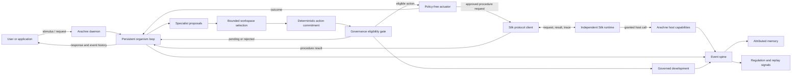

# Arachne 2 architecture

**Task:** AR-01  
**Status:** Architecture specification  
**Inputs:** [reimplementation PRD](../prds/prd-arachne-and-silk-2.md), [reference inventory](REFERENCE_INVENTORY.md), and [compatibility decisions](COMPATIBILITY_DECISIONS.md).

## Purpose and system boundary

Arachne is one long-running cognitive organism. It manages agent lifecycles, cognitive events, attributed memory, specialist coordination, regulation, governance, and provenance-bearing change. It consumes Silk through a versioned external protocol. It does not link against Silk internals or share mutable state with the Silk process.

This diagram shows conceptual responsibilities, not process topology or a prescribed implementation order. The first integration should use a protocol boundary, such as local IPC or a subprocess protocol. Rust/Go FFI and shared database tables are not the default integration path.

## Core subsystems and responsibility boundaries

| Subsystem                  | Arachne responsibility                                                                                                                                         | Boundary and invariants                                                                                                                                                                 |
| -------------------------- | -------------------------------------------------------------------------------------------------------------------------------------------------------------- | --------------------------------------------------------------------------------------------------------------------------------------------------------------------------------------- |
| Organism daemon            | Own process lifecycle, configuration, cancellation, and composition of organism services. The persistent organism runtime owns the perception-to-outcome loop. | Starts and stops cleanly. It coordinates services but does not contain specialist reasoning or bypass their interfaces.                                                                 |
| Agent lifecycle            | Activate, supervise, and attribute specialist work for an organism session.                                                                                    | Agent input/output is explicit. An agent's Silk procedure runs through the Silk protocol; agent identity does not grant host authority by itself.                                       |
| Silk client and host       | Create Silk sessions, provide declared Arachne host functions, apply session grants, and ingest Silk traces.                                                   | Uses the same public protocol available to other hosts. Arachne owns host function behavior; Silk owns parsing, evaluation, and its trace semantics.                                    |
| Cognitive event spine      | Assign event identity/order and connect stimulus, agent, proposal, selection, decision, action, outcome, and trace records.                                    | One event model is the audit and reconstruction path. Subsystems do not keep private, uncorrelated versions of major cognitive events.                                                  |
| Attributed memory          | Store experiences and derived records with source, time, agent/session, confidence/status, and contradiction links. Retrieve only through explicit interfaces. | Separate observed experience from candidate interpretation and promoted semantic/identity state. Ghostdive is a distinct project and is not embedded here.                              |
| Bounded workspace          | Collect specialist proposals, compare them, admit a limited subset, and report why selection occurred.                                                         | Proposals are not actions. Admission is observable, bounded, and cannot itself authorize consequential effects.                                                                         |
| Regulation                 | Derive signals such as prediction error, salience, load, or action pressure and expose explicit policy effects.                                                | Signals influence declared cognitive mechanisms through traceable rules. A signal does not silently grant authority or mutate protected state.                                          |
| Governance                 | Evaluate consequential actions and changes against typed constraints, approvals, evidence, and scope.                                                          | Governance sits above technical executability. It cannot be replaced by prompt instructions or a Silk grant; a Silk grant alone cannot approve organism-level retention or development. |
| Replay and consolidation   | Revisit attributed experience to produce retrieval, attention, or development candidates.                                                                      | Replay is observable and may propose candidates. It cannot directly grant authority, apply protected changes, or promote memory without the ordinary governance path.                   |
| Development and provenance | Admit approved changes to memory policy, routing, specialist configuration, or retained procedures, recording their origin and review.                         | Every lasting difference has a causal record and governance outcome. Arachne proposes/adopts through public interfaces; it never mutates Silk internals.                                |
| Inspection                 | Present event timelines, agent/workspace outcomes, memory lineage, regulatory signals, governance history, and changes.                                        | Inspection reads the same canonical event and provenance records used by execution. It must not invent inferred state without labeling it.                                              |

## End-to-end cognitive cycle

1. The daemon accepts a stimulus and creates an organism session with explicit input, limits, and host policy.
2. Perception and relevant memory retrieval emit attributed events. Retrieval records what was available and which evidence was returned.
3. The persistent Arachne organism loop activates a bounded set of specialists. Each returns a validated, attributed proposal linked to the perception and source events.
4. A fresh bounded workspace run records proposal admission and selection. Selection only chooses proposals; it does not commit or execute an action.
5. A deterministic commitment policy considers valid requested actions from selected proposals and records the chosen action, proposal attribution, and rationale. If none qualify, it records a no-op and does not call the actuator.
6. A separate eligibility gate records its result for the committed action. Consequential adapters translate it into a governance proposal; pending or rejected decisions cannot proceed.
7. Only an eligible committed action reaches the injected policy-free actuator. Its result or failure is recorded as an outcome linked to the action, gate, commitment, selection, proposal, activation, and perception events.
8. The loop returns the stage results and event IDs. Memory and regulation consume events through explicit interfaces; replay may create candidates, and promotion and development follow the normal governance path.

The system must be able to reconstruct a completed cycle from structured events, including failures and denied actions. Earlier host calls are not presumed rolled back when a later step fails.

## Smallest coherent organism

The initial organism needs a daemon, one or more supervised agents, the event spine, a public Silk client boundary, a bounded proposal/selection path, minimal attributed episodic storage, and inspectable governance for at least one consequential action. These parts make a useful closed loop while keeping advanced cognition small.

Semantic memory, learned identity, replay, regulation, procedural acquisition, and topology changes should be added only when an experiment has a defined input, expected observation, and falsifiable outcome. The architecture reserves interfaces for them but does not require a complex implementation in the initial daemon.

## Research evidence and design consequences

| Finding                                                                                                                                                   | Architectural consequence                                                                                                                                                  | Evidence boundary                                                                                             |
| --------------------------------------------------------------------------------------------------------------------------------------------------------- | -------------------------------------------------------------------------------------------------------------------------------------------------------------------------- | ------------------------------------------------------------------------------------------------------------- |
| Typed governance checks outperformed prompt-only or fixture-backed hints on the documented deterministic proposal workload.                               | Protected changes require typed checks and explicit approval/evidence fields; prompts may inform a proposal but cannot authorize it.                                       | Paper Experiment 3 is simulated and local. It does not establish live-model or adversarial safety.            |
| A cross-agent protected-change fixture rejected a proposal without external approval; constrained adaptation represented rationale and rollback metadata. | Record proposer, target scope, reviewer/approval, evidence, and rollback data; denial must happen before mutation.                                                         | The trials leave targets inert; they do not demonstrate real rollback or human approval workflows.            |
| Active-inference/SWR fixtures preserve signal and authority lanes and report restart continuity.                                                          | Regulation and replay publish signals/candidates through explicit paths. They do not apply deltas or gain write authority.                                                 | Results are bounded local operational fixtures, not proof of complete active inference or production routing. |
| Identity memory and residue work track source events, revisions, contradiction, and candidate status.                                                     | Store provenance and epistemic status with memory records; keep retrieval inspection non-mutating.                                                                         | Local acceptance is not canonical endorsement or stable identity.                                             |
| DCHM replay comparisons were null/noisy across seed batches; some other measurements are synthetic and workload-specific.                                 | Keep negative results and metric provenance next to positive results. Do not add adaptive complexity without reproducing a workload and demonstrating a measurable effect. | No causal learning, generalization, production performance, or emergence claim follows from these records.    |

The reference inventory links the corresponding old-repository artifacts and records their limitations. These findings justify boundaries and experiment targets; they are not evidence that the architecture already works.

## Deferred or excluded from the core

- Silk parsing, evaluation, semantic IR, procedure registry, and execution remain Silk responsibilities.
- Ghostdive remains separate from Arachne's runtime memory interfaces.
- Legacy ZMQ transport details, broad organism builtin surfaces, and module-specific state stores are not preserved unless a named requirement needs them.
- Automatic topology rewrites, unrestricted self-modification, direct database access between Silk and Arachne, and implicit host permissions are excluded.
- A bytecode VM, distributed scheduling, production-scale fault tolerance, and claims of general cognition remain evidence-led future decisions.

## Open architecture questions

- Which minimal event fields and ordering guarantees are required for reliable replay across daemon restart?
- What is the smallest useful specialist workload for the first integrated experiment?
- Which records should be durable from the start, and which may be rebuilt from event history?
- What approval policy can be exercised end to end by the initial development experiment without implying human review that does not exist?
