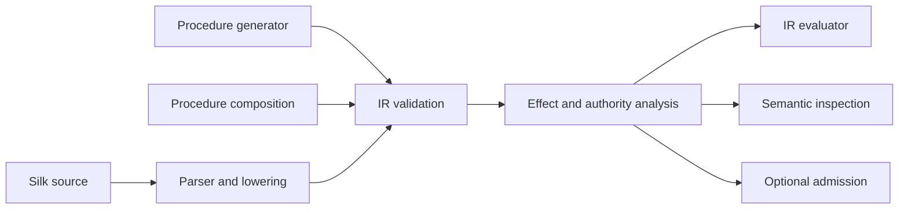

# Silk semantic intermediate representation

**Task:** SILK-07  
**Schema identifier:** `silk.ir.v1`  
**Inputs:** [language semantics](SILK_LANGUAGE_SEMANTICS.md), [syntax dispositions](SILK_SYNTAX_COMPATIBILITY.md), [host protocol](SILK_HOST_PROTOCOL.md), and [effects/authority](SILK_EFFECTS_AUTHORITY.md).

## Design goals

The semantic IR is the canonical, executable representation of a Silk procedure. Source parsing is one frontend that constructs it; generators and composers may construct it directly. The IR records meaning and dependencies without requiring source text, parser tokens, or an Arachne runtime.



Validation establishes structural consistency, not trust or permission. A valid procedure may still require grants, fail a contract at runtime, or need Arachne governance before it is retained or used for a consequential action.

## Representation envelope

`ProgramIR` is a versioned collection of procedure definitions, capability contracts, external dependencies, and optional source mappings. Its serialized envelope contains:

| Field            | Meaning                                                                                                                                                                      |
| ---------------- | ---------------------------------------------------------------------------------------------------------------------------------------------------------------------------- |
| `schema_version` | Exact schema identifier, initially `silk.ir.v1`.                                                                                                                             |
| `program_id`     | Opaque program identity. Source compilation currently assigns a provisional key; persisted identity and digest rules are specified by [SILK-13](SILK_PROCEDURE_IDENTITY.md). |
| `procedures`     | Executable procedure definitions keyed by opaque procedure ID.                                                                                                               |
| `capabilities`   | Exported semantic contracts that name the procedure and describe its intent, inputs/outputs, effects, authority requirements, and provenance.                                |
| `dependencies`   | Referenced procedures, host functions, core functions, and imported modules with their expected identity/schema digests.                                                     |
| `source_map`     | Optional mapping from procedure/block/instruction IDs to source digest and spans. The source text itself is not required.                                                    |

The envelope uses normalized identifiers and deterministic ordering for serialization and hashing. Unknown required schema versions fail validation. Additive optional fields require a compatible schema evolution; a change to execution or authority meaning requires a new major schema identifier.

## Procedure model

A `ProcedureDefinition` contains an opaque ID, optional human-readable name, typed parameter bindings, return type, entry block, basic blocks, declared effect ceiling, inferred effect summary, dependency references, contract, and provenance. Names help humans; all internal call edges resolve by ID or exact host-function name.

Procedure identity is opaque in this schema. [SILK-13](SILK_PROCEDURE_IDENTITY.md) defines stable lineage IDs, immutable revision digests, names, and provenance. The current parser IR does not yet implement those persisted fields; its FNV source fingerprint is only a provisional compilation key.

Local immutable bindings and session state are distinct. `let` values are local SSA-style value references. A `state` binding has a stable session-state slot; reading or writing it uses explicit IR operations and contributes the matching `session_state_read` or `session_state_write` effect. State slots are session-local, not durable memory.

## Control flow and operations

Control flow is a graph of basic blocks. Each block has a stable block ID, an ordered instruction list, and exactly one terminator. Values defined by instructions have unique IDs within a procedure; operands refer to those IDs or to declared parameters/state slots.

Initial instruction families are:

- constants and JSON-compatible value construction;
- immutable local binding reads;
- session-state reads and writes;
- unary/binary operations, comparisons, and collection/string access;
- core-function calls;
- static procedure calls;
- declared host-function calls, carrying exact name, effect set, and authority reference;
- contract assertions and explicit error propagation.

Initial terminators are `jump`, boolean `branch`, `return`, `yield`, and `end` (which returns `null` when no value is present). Loop constructs lower to blocks and back edges. `break` and `continue` are represented by the corresponding control-flow target, not evaluator-side parser state. Evaluation remains a graph-walking semantic evaluator; this representation is not a bytecode instruction set.

Call targets are explicit variants: `core`, `procedure`, `host_function`, or `dynamic`. A dynamic target records its candidate dependencies and possible effect set. Unresolved or dynamic targets include `unknown` in effect analysis and receive no ambient authority. Runtime resolution still requires an exact session descriptor and a matching grant.

## Capability contract

A capability is a semantic export, not an authority token. It points to one or more procedures and carries:

- a human-readable purpose and normalized semantic description;
- input and output schemas;
- preconditions and postconditions represented by boolean contract expressions in the procedure's IR;
- direct/transitive effects and host-function dependencies;
- required authority identifiers;
- provenance and validation evidence references.

Contracts are checked at explicit boundaries. A schema constrains values and shape; it does not prove a procedure is safe or authorize a host call. A grant authorizes a session call; it does not prove a capability's postcondition or approve Arachne retention.

## Dependencies, effects, and authority

Dependencies are explicit edges. A procedure reference names a procedure ID. A host dependency names the exact descriptor plus its expected schema digest, effect set, and authority identifier. A core-function dependency names a versioned language-core function. An import/module dependency names a normalized module ID and content digest; it cannot introduce network fetching or grant authority.

The `silk-runtime::analyze_effects` pass recomputes direct and transitive effects from instructions/call edges and produces inspectable summaries. Serialized summaries are validation hints, not trusted inputs: a consumer must recompute or verify their digest before execution. A declared effect ceiling smaller than the inferred set is a validation error. Required authorities are descriptive dependencies. The active session must still pass the runtime grant check immediately before every host dispatch.

## Provenance and source independence

Provenance distinguishes `human_authored`, `legacy_migration`, `generated`, and `composed` origins. Records may include source-reference pin and digest, generator identity, parent procedure IDs, composition plan, validation results, and evidence references. Provenance fields are claims to inspect; they are not self-authenticating and do not grant permission.

Source mappings are optional. If present, they contain a source digest and byte spans, not a requirement that the original source be available. A generated procedure can therefore contain complete executable semantics and provenance without ever having a Silk source representation.

## Deterministic validation

IR loading validates in a fixed order:

1. Schema version, canonical IDs, duplicate IDs, and envelope bounds.
2. Entry block, block terminators, successor references, instruction IDs, and value definition/use rules.
3. Procedure signatures, call arity/type compatibility, module/dependency identities, and capability references.
4. Host descriptor name/effect/authority consistency; this stage checks declarations, not session grants.
5. Recomputed direct/transitive effects, dynamic-call uncertainty, and declared effect ceilings.
6. Contract schema and predicate well-formedness; runtime contract checks execute at their declared boundaries.

An invalid IR is rejected before evaluation. Runtime host calls still validate arguments and grants immediately before dispatch. Validation errors are structured and point to an IR object ID and optional source span.

## Example shape

The following shows an envelope shape only; stable field-level JSON encoding is versioned with the future `silk-ir` crate:

```json
{
  "schema_version": "silk.ir.v1",
  "program_id": "opaque-program-id",
  "procedures": [
    {
      "id": "opaque-procedure-id",
      "name": "summarize",
      "parameters": [{ "id": "p0", "type": "string" }],
      "entry_block": "b0",
      "blocks": [
        {
          "id": "b0",
          "instructions": [
            {
              "id": "i0",
              "result": "v0",
              "op": {
                "host_function": "language.summarize",
                "arguments": ["p0"],
                "effects": ["host_read"],
                "authority": "language.summarize"
              }
            }
          ],
          "terminator": { "return": "v0" }
        }
      ],
      "effect_ceiling": ["host_read"]
    }
  ],
  "capabilities": [],
  "dependencies": []
}
```

The `silk-ir` crate currently defines and serializes the executable core used by SILK-08/09. Capability contracts, dependency digests, typed signatures, and canonical cryptographic serialization remain to be added before IR is used as a portable or persisted artifact. This example does not define a host schema or session grant.

## Boundaries and follow-up

- [SILK-08 defines the first grammar-to-IR mapping](SILK_PARSER_LOWERING.md); [SILK-09 implements the graph evaluator](SILK_EVALUATOR.md). Import/export syntax, contracts, effect extraction from IR, and full static validation remain later work.
- SILK-11 adds event tracing; SILK-12 builds source-independent inspection.
- [SILK-13 defines procedure/capability identity, lineage, and provenance](SILK_PROCEDURE_IDENTITY.md) before registry work. Provenance is inspectable but not self-authenticating.
- Bytecode remains deferred until a measured need justifies a second execution representation.
